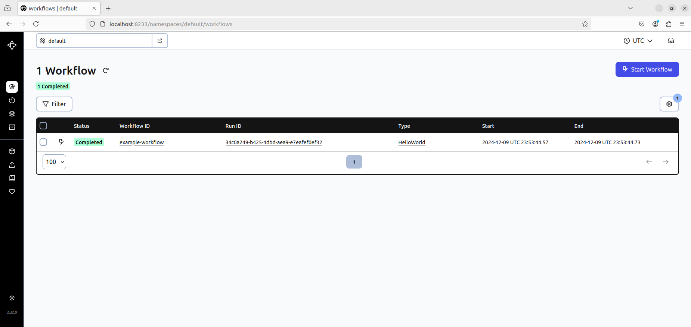
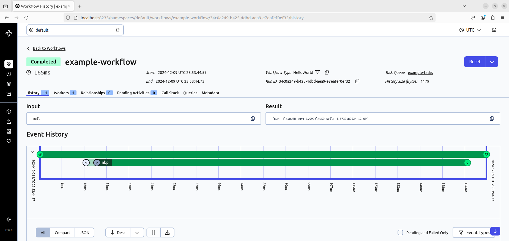
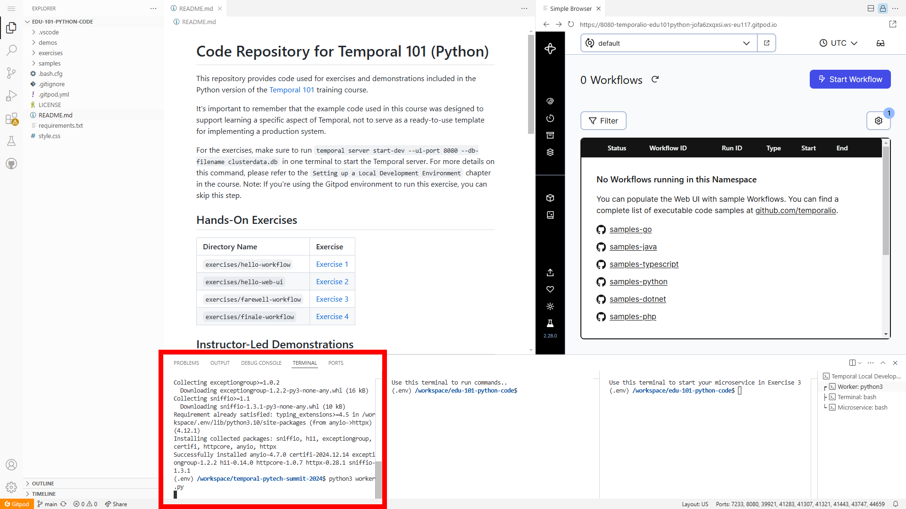
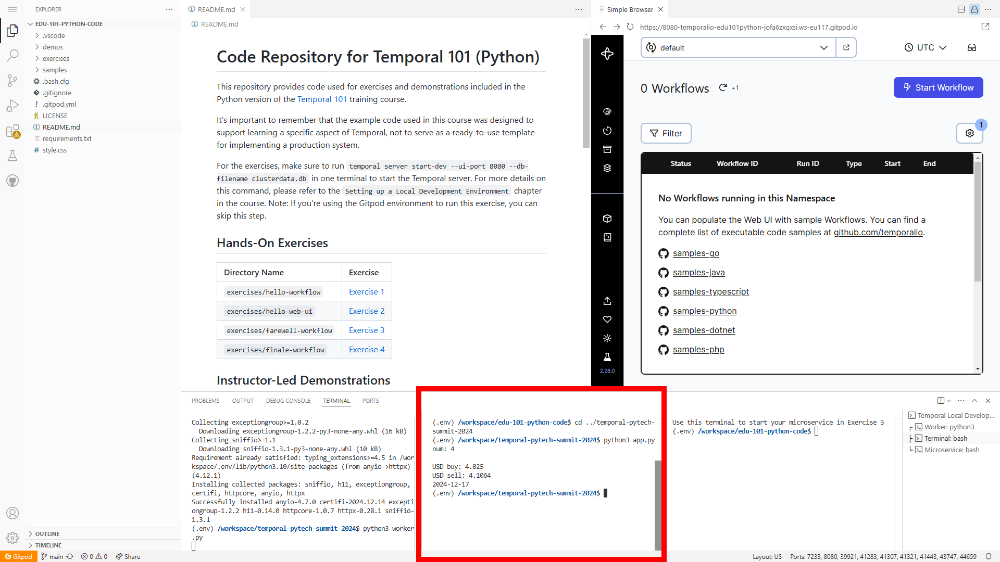
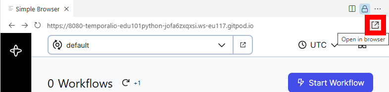
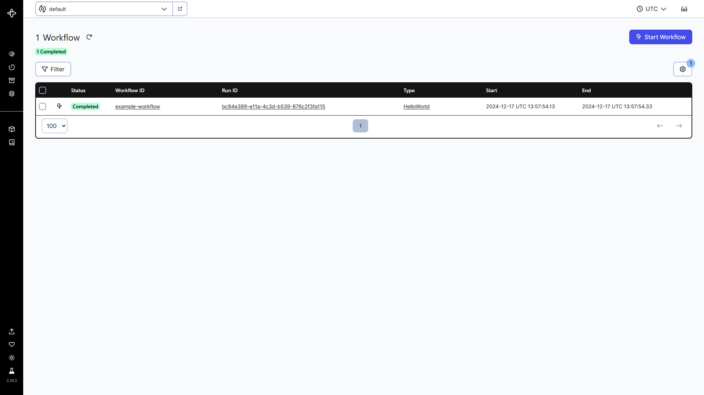
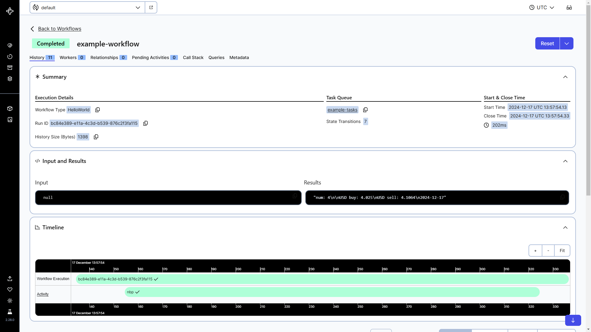

# Falling in Love with Temporal: Bulletproof Workflows

## Option 1: Demo with local development environment
### Step 1/4: Installation
**Install Temporal CLI**

To install the Temporal CLI, download the version for your architecture:
- [Download Temporal CLI for Linux amd64](https://temporal.download/cli/archive/latest?platform=linux&arch=amd64)
- [Download Temporal CLI for Linux arm64](https://temporal.download/cli/archive/latest?platform=linux&arch=arm64)

For example: `temporal_cli_1.1.2_linux_amd64.tar.gz` file.

Extract the downloaded archive. Example:
```sh
$ tar xzf temporal_cli_1.1.2_linux_amd64.tar.gz
```

Add the `temporal` binary to your `PATH` by copying it to a directory like `/usr/local/bin/`.
Example:
```sh
$ mv temporal /usr/local/bin/
```

**Install Temporal SDK**

Install the Temporal Python SDK:
```sh
$ pip install temporalio
```

**Install [HTTPX](https://github.com/encode/httpx/) Python lib**:
```sh
$ pip install httpx
```

### Step 2/4: Start Temporal Server
Open a new terminal window and run the following command:
```sh
$ temporal server start-dev
```

This command starts a local Temporal Server. It starts the Web UI, creates the `default` [Namespace](https://docs.temporal.io/namespaces?_gl=1*c6vqdb*_gcl_au*MTIwMzc0ODY4OC4xNzMzMjU2NDU0*_ga*MTY3NTk4Mzk3MC4xNzMzMjU2NDU0*_ga_R90Q9SJD3D*MTczMzY5MjczMy45LjEuMTczMzY5MzM1My4wLjAuMA..), and uses an in-memory database.

The Temporal Service will be available on `localhost:7233`.
The Temporal Web UI will be available at http://localhost:8233.

Leave the local Temporal Server running. You can stop the Temporal Service at any time by pressing `Ctrl+C`.

### Step 3/4: Start Temporal Worker
Open a new terminal window and run the following command:
```sh
$ python3 worker.py
```
Leave the Temporal Worker running.

### Step 4/4: Execute Temporal Workflow
Open a new terminal window and run the following command:
```sh
$ python3 app.py
```

Example output:
```sh
num: 4

USD buy: 3.9926
USD sell: 4.0732
2024-12-09
```

Navigate to Temporal Web UI at http://localhost:8233 to see Temporal Workflows:


Click on `example-workflow` Workflow ID to see Temporal Workflow History and Execution Result:


## Option 2: Demo with Gitpod (browser-based environment)
Not everyone is willing to use a local environment and install software for a demo. That is why you can use the Gitpod service with a browser-based environment as an alternative.

### Step 1/3: Clone GitHub repo and install [HTTPX](https://github.com/encode/httpx/) Python lib
Navigate to https://gitpod.io/#https://github.com/temporalio/edu-101-python-code to launch a browser-based environment.

In the **first** terminal window, execute the following command:
```sh
$ cd ..
$ git clone https://github.com/korniichuk/temporal-pytech-summit-2024.git
$ cd temporal-pytech-summit-2024
$ pip install httpx
```


### Step 2/3: Execute Temporal Workflow
In the **first** terminal window, run the following command:
```sh
$ python3 worker.py
```

Leave the Temporal Worker running.



### Step 3/3: Execute Temporal Workflow
In the **second** terminal window, run the following command:
```sh
$ cd ../temporal-pytech-summit-2024
$ python3 app.py
```

Example output:
```sh
num: 4

USD buy: 4.025
USD sell: 4.1064
2024-12-17
```



Navigate to Temporal Web UI to see Temporal Workflows:  




Click on `example-workflow` Workflow ID to see Temporal Workflow History and Execution Result:


## Sources
- [Set up a local Temporal Service for development with Temporal CLI](https://learn.temporal.io/getting_started/python/dev_environment/?os=linux#set-up-a-local-temporal-development-cluster)
